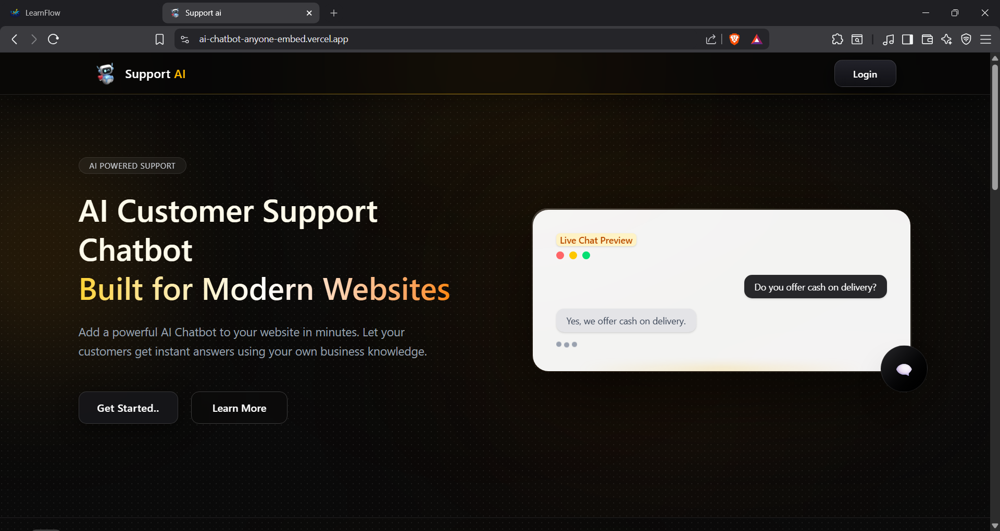
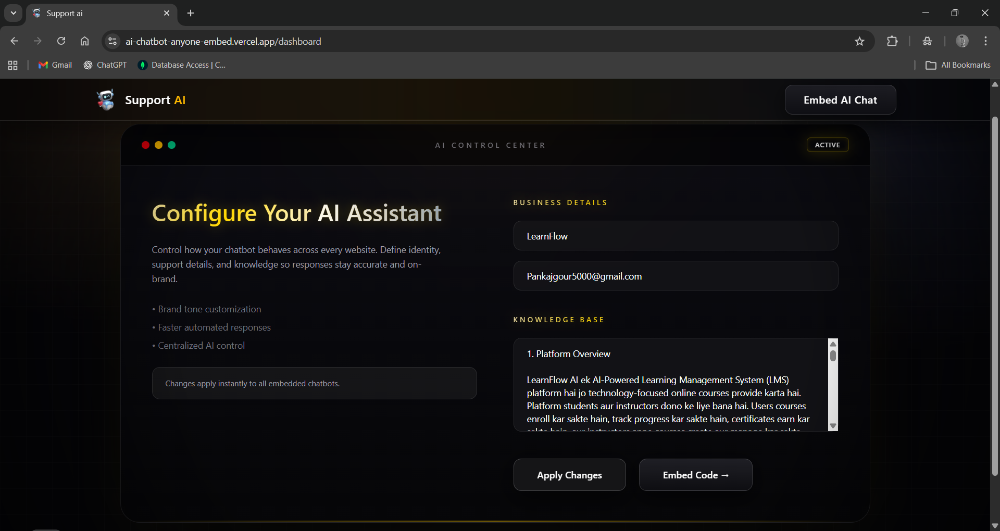
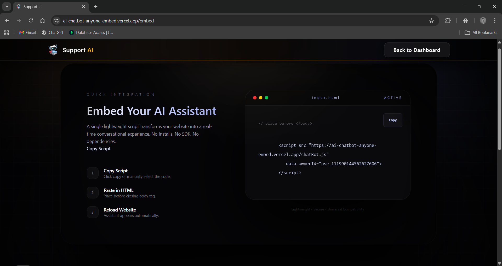
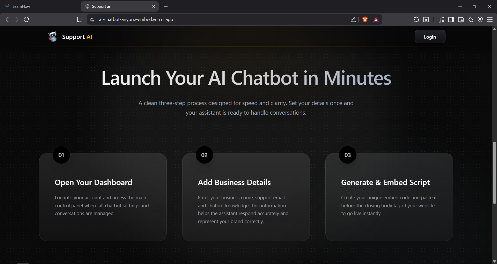

<div align="center">

<h1>🗨️ Support AI</h1>

<h3>
Embed-Ready Customer Support Chatbot
</h3>

<p>
Transform any website into an intelligent support experience within minutes.<br/>
No SDKs. No complex setup. Just <b>Copy → Paste → Go Live.</b>
</p>

<br/>



<br/><br/>

<p>
  
  
  
  
  
</p>

<p>
  
  
  
</p>

</div>

---

## 🚀 Live Experience

**Production URL**  
https://ai-chatbot-anyone-embed.vercel.app

---

## ✨ Why Support AI?

Support AI is engineered as a **complete SaaS-grade product**, not just a widget.  
It understands your business context, adapts to visitor language, and delivers instant responses —  
all while keeping integration effortless and lightweight.

---

## 📌 Interface Preview

### Landing Experience


### Dashboard Control Center


### Embed Script Generator


### Live Chat Experience


---

## 🌟 Core Capabilities

- Instant Website Embed Script  
- Business Knowledge-Aware Conversations  
- Multi-Language Adaptation  
- Identity & Meta Question Handling  
- Secure Session Dashboard  
- Dark Premium Glass UI  
- Scalable MongoDB Backend  
- Serverless Optimized Deployment  

---

## 🧠 Workflow

**1. Login → Dashboard**  
Configure chatbot identity, tone, and knowledge.

**2. Add Business Details**  
Business Name • Support Email • Knowledge Base

**3. Generate Script**  
One click → unique embed code.

**4. Paste into Website**  
Place before `</body>` tag.

**5. Go Live**  
Refresh — assistant appears instantly.

---

## 🛠 Technology Stack

**Frontend**
- Next.js  
- React  
- Tailwind CSS  
- Framer Motion  

**Backend**
- Next.js API Routes  
- MongoDB + Mongoose  
- Google Gemini AI  

**Deployment**
- Vercel Serverless  

---

## 📦 Installation

```bash
git clone https://github.com/Pankajgour12/AI-Chatbot-Anyone-Embed.git
cd AI-Chatbot-Anyone-Embed
npm install
```

---
## ⚙️ Environment Variables

To run this project, you will need to add the following environment variables to your `.env.local` file:

```env
# Scalekit Configuration
SCALEKIT_ENV_URL=your_scalekit_env_url
SCALEKIT_CLIENT_ID=your_scalekit_client_id
SCALEKIT_CLIENT_SECRET=your_scalekit_client_secret

# Database & AI
MONGODB_URI=your_mongodb_connection_string
GOOGLE_GEMINI_API_KEY=your_gemini_api_key

# App URL
NEXT_PUBLIC_APP_URL=http://localhost:3000
```

---

---

## 🏗️ Development Setup

Follow these steps to get the project running locally:

1.  **Setup Scalekit:** Go to your [Scalekit Dashboard](https://app.scalekit.com/), create an application, and configure your redirect URIs.
2.  **Setup MongoDB:** Create a cluster on MongoDB Atlas and get your connection string.
3.  **AI Configuration:** Get your API Key from [Google AI Studio](https://aistudio.google.com/).
4.  **Run Locally:**
    ```bash
    npm run dev
    ```
5.  **Access App:** Open [http://localhost:3000](http://localhost:3000) in your browser.

---


## 🔌 Integration Guide

Integrating the chatbot into your HTML website is as simple as adding a script tag.

### Example:
```html
<script 
  src="[https://ai-chatbot-anyone-embed.vercel.app/api/embed?id=YOUR_BUSINESS_ID](https://ai-chatbot-anyone-embed.vercel.app/api/embed?id=YOUR_BUSINESS_ID)" 
  defer>
</script>
```
---


## 🤝 Let's Connect & Collaborate


If you like this project, feel free to reach out or follow my journey!

<p align="left">
  <a href="https://github.com/Pankajgour12" target="_blank">
    
  </a>
  <a href="https://linkedin.com/in/pankajgour404" target="_blank">
    
  </a>
  <a href="https://x.com/Pankajgour404" target="_blank">
    
  </a>
  <a href="https://www.instagram.com/pankaj_vimla_gour" target="_blank">
    
  </a>
</p>

---

<div align="center">
  <p>Built with 🚀 using <b>Next.js</b>, <b>Scalekit</b> & <b>Gemini AI</b></p>
 
</div>


